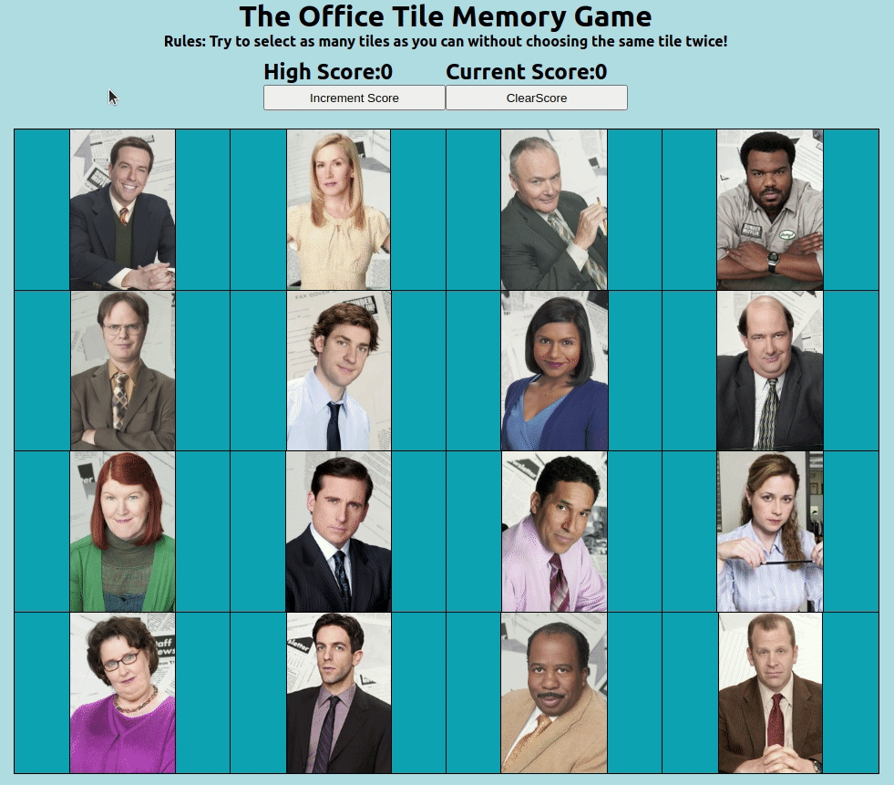
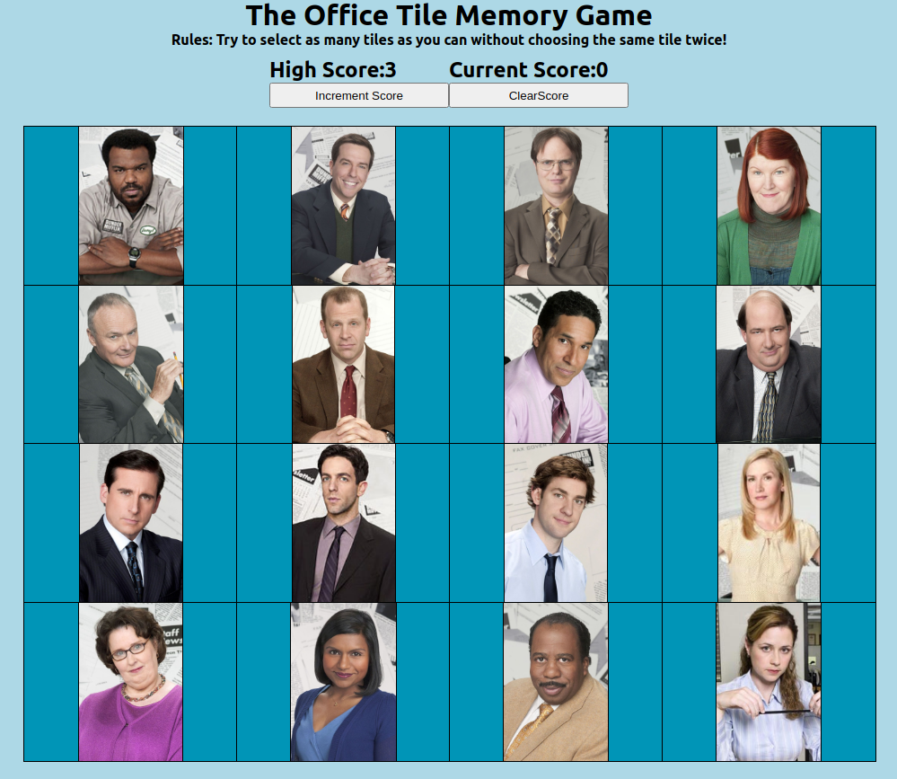

<h4 align="center">


</h4>

## Tile Memory Game
Tile Memory Game where you try not to select the same tile twice.

## Description

Tile Memory Game made with React using characters from The Office. The goal is to select as many tiles as possible without choosing the same tile twice. Every time a tile is clicked the order is randomized making it difficult to keep track of what was clicked. A high score counter keeps track of the total score, and the score resets whenever a tile is selected a second time.

## Why?

The purpose of this project was to practice using React and breaking up parts of a simple app into React components. This was a fun project to practice the main React concepts such as components, hooks, props, and to get an understanding of the component lifecycle. All components in this project are functional components that make use of hooks to track state. Specifically useState and useEffect hooks were used to manage the state for the current score, high score, tile position, and if a tile was clicked. For this project it was particularly interesting to come up with the logic to randomize the tile display positions but still keep track of which tiles had been clicked. 

## Usage/Install

Clone the project and then cd into the folder.

To install the dependencies, with [npm](https://npmjs.org/) installed, run

```
$ npm install
```

To run the app in development mode, run

```
$ npm start
```

To build the app for production, run

```
$ npm run build
```